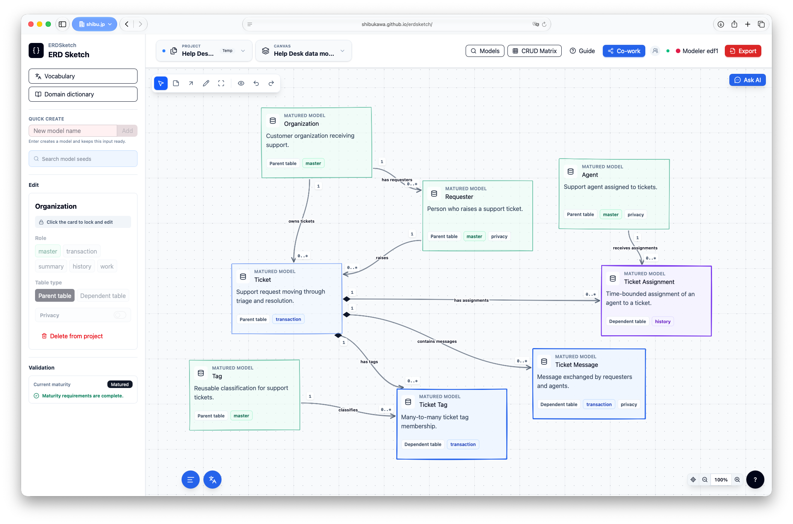
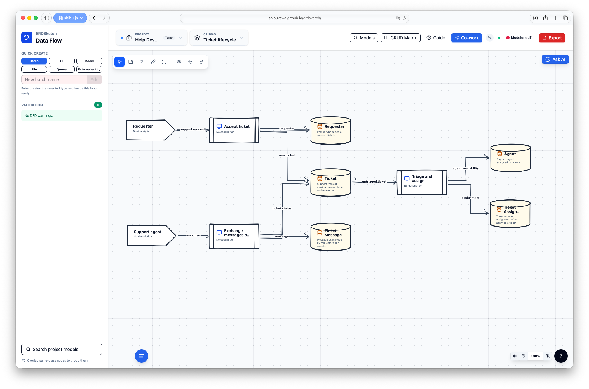
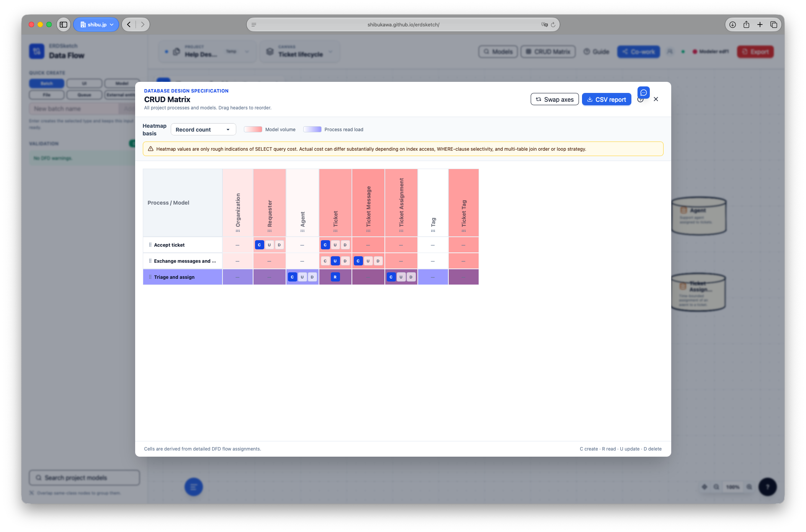
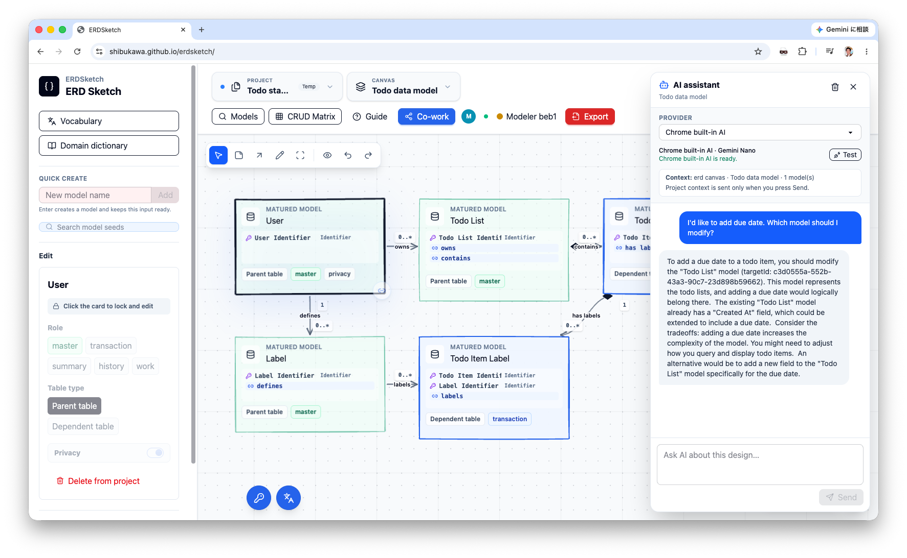

# ERDSketch

[English](README.md) | [日本語](README.ja.md)

ERDSketchは、ラフな「Concept Seeds」をデータフロー、論理モデル、物理スキーマ、プレーンテキストの設計ナレッジへ育てるDesign IDEです。ERDを完成品ではなく、より広いモデリングプロセスの一段階として扱います。

[](https://shibukawa.github.io/erdsketch/)

## 公開デモ

インストールせずにERDSketchを試せます。

**https://shibukawa.github.io/erdsketch/**

静的デモはすべてブラウザ内で動作します。アカウント、APIキー、バックエンド、GPT-5.6へのアクセスは必要ありません。明示的にエクスポートするかローカルフォルダーを選択しない限り、プロジェクトデータはブラウザ内に残ります。

## スクリーンショット

| データフロー図 | CRUDマトリクス |
| --- | --- |
|  |  |

### AIアシストによるモデリング



## 主な機能

- Todo、Blog、Help Deskの完成済みサンプル、または空のプロジェクトから開始
- Concept Seedsからエンティティ、フィールド、リレーション、複数キャンバスのERDへ発展
- DFDによる業務プロセスの記述とデータモデルへの接続
- 共通Vocabularyと再利用可能なData Domainの管理
- CRUD利用状況、モデル成熟度、レコード数、ストレージ容量のレビュー
- キャンバス上への共同編集可能なフリーハンドAnnotation
- 手動シグナリング方式のWebRTCによるピアツーピア共同編集
- ブラウザ内で復旧可能なプロジェクト管理と、Gitで扱いやすい分割YAMLの入出力
- SQL DDL、JSON、Draw.io、ドキュメントバンドルなどの設計成果物の出力

## クイックスタート

### 必要環境

- Node.js 24 LTS
- npm

リポジトリを取得し、フロントエンド開発サーバーを起動します。

```bash
git clone https://github.com/shibukawa/erdsketch.git
cd erdsketch
npm ci
npm run dev
```

**http://127.0.0.1:5173/** を開きます。

このフロントエンドのみの開発モードにGoやTinyGoは不要です。GoのリレーAPIが利用できない場合、ブラウザが自動的に単独のローカルセッションホストになります。

## 審査用5分ウォークスルー

公開デモが最短の確認方法です。

1. [公開デモ](https://shibukawa.github.io/erdsketch/)を開きます。
2. **Blog**、**Todo**、**Help Desk**のいずれかのスタータープロジェクトを選びます。
3. Concept SeedsキャンバスからERD、DFDの各キャンバスへ移動します。
4. エンティティのフィールド、リレーション、Vocabularyとの紐付け、Data Domain、CRUD情報、データ量見積もりを確認します。
5. モデルを編集するかAnnotationを追加し、ページを再読み込みしてブラウザ内の復旧を確認します。
6. **Projects**を開き、プロジェクトの作成、保存、読み込み、インポート、エクスポートを試します。

スタータープロジェクトは組み込まれているため、サンプルデータを別途ダウンロードする必要はありません。

## CodexとGPT-5.6による開発

ERDSketchはOpenAI Build Week期間中、ナレッジ駆動のCodexワークフローを反復して開発しました。複数のモデル設定を試しましたが、実装作業の大部分では、**Codex上のGPT-5.6 SolをMediumのreasoning effortで使用**しました。

ほぼすべての主要機能をCodexの`/goal`で実装しています。

- ERDモデリング
- DFDモデリング
- VocabularyとData Domainの管理
- WebRTC共同編集
- プロジェクト管理と復旧
- キャンバスAnnotation
- 永続化、インポート、エクスポート、各配布形態

GPT-5.6はCodexにおける主要な実装モデルであり、現在のアプリケーション実行時には必要ありません。ERDSketchにはChrome Built-in AIとユーザーが設定するローカルOpenAI互換サーバーに対応した初期段階のAIアシスタントがありますが、これはGPT-5.6を使った開発プロセスとは別の機能で、プロジェクトの実行や審査には必要ありません。

### ナレッジ駆動の開発ループ

実装コンテキストに探索時のノイズを入れないため、発散的な検討と実装を意図的に分離しています。

1. **リポジトリ外で探索する。** ChatGPTとプロダクトや設計について徹底的に議論します。発散的な会話をCodexプロジェクト外に置くことで、採用しなかった案や会話上のノイズが実装セッションに入ることを防ぎます。
2. **結果を蒸留する。** まとまった単位で、長い会話履歴ではなく、有用な結論を焦点の合ったMarkdownとしてChatGPTに出力させます。
3. **プロジェクトナレッジへコンパイルする。** CodexからカスタムKnowledge Compilerスキルを利用し、蒸留した内容を小さく相互参照可能な概念へ変換して[`.knowledge/`](.knowledge/)に格納します。現在のカタログには、要件、フロー、ルール、UI、データ、システム、設計判断を含む277個のソース概念があります。
4. **Codexと詳細を詰める。** 実装前にカタログを基準として、細かな要件や矛盾を解決します。
5. **まとまったGoalとして実装する。** 切り離されたコード生成プロンプトを繰り返すのではなく、`/goal`からGPT-5.6 Solへ一貫した実装成果を依頼します。
6. **確認して仕様へ戻す。** 動作を確認し、軽微なUI修正はその場で依頼します。内部設計に影響する場合はKnowledge Compilerへ戻し、仕様層から同じループを繰り返します。

これにより、`.knowledge`は人間によるプロダクト検討とCodexによる実装の間にある、永続的な契約として機能しました。後続セッションはチャット履歴全体を読み込んだり信頼したりせずに、過去の判断を復元できます。

### 主要な設計判断の例

- [`concept:design-ide`](.knowledge/concept/design-ide.md)：通常のERDエディターとDesign IDEを区別し、モデルの成長、背景知識、設計判断を中心にプロダクトを定義しています。
- [`flow:modeling-lifecycle`](.knowledge/flow/modeling-lifecycle.md)：業務知識、DFDからの探索、Vocabulary、論理モデル、正規化、ストレージ設計、レビューを接続しています。
- [`decision:frontend-session-authority`](.knowledge/decision/frontend-session-authority.md)：共同編集の正準状態と競合判断をリレーサーバーではなく、最初に参加したブラウザへ置いています。
- [`decision:dedicated-persistence-worker`](.knowledge/decision/dedicated-persistence-worker.md)：復旧用I/O、アーカイブ処理、圧縮をUIスレッドから分離しています。
- [`decision:manual-webrtc-signaling`](.knowledge/decision/manual-webrtc-signaling.md)：シグナリングサービスを追加せず、URLフラグメントの手動交換でピアツーピア共同編集を成立させています。
- [`decision:storage-adapter-selection`](.knowledge/decision/storage-adapter-selection.md)：静的Web、Goサーバー、Wailsデスクトップで共通の永続化契約を定義しています。

リポジトリのコミット履歴と`.knowledge`内のソース概念が、イベント期間中に仕様と実装がどのように発展したかを示すタイムスタンプ付きの証拠です。

## テスト

標準のフロントエンドテストとGoテストを実行します。

```bash
npm test
go test ./server/...
```

フロントエンドのテストには、すべての組み込みスタータープロジェクトに対する共通検証も含まれます。

## 本番ビルドと配布

本番ビルドにはNode.js 24 LTSとGo 1.26を使用します。静的ビルドではエクスポートエンジンをWebAssemblyへコンパイルするため、追加でTinyGo 0.41.1が必要です。

```bash
npm run build:static   # dist/static。TinyGoが必要。実行時のGo APIは不要
npm run build:server   # server/webassets/dist。Goバイナリへ埋め込み
npm run build:desktop  # desktop/frontend/dist。Wailsへ埋め込み
```

GitHub Actionsの`Deploy static site to Pages`ワークフローが、`main`から静的ビルドを公開します。

### Goバックエンド

Goの共同編集・プロジェクトファイル用バックエンドは、Vite開発サーバーとは別に起動します。

```bash
go run ./server/cmd/erdsketch
```

Viteは5173番ポートへの`/api`リクエストを`http://127.0.0.1:8080`へ転送します。サーバーは`ERDSKETCH_ADDR`、`ERDSKETCH_MODEL_ROOT`、`ERDSKETCH_PROJECT_ROOT`環境変数を受け付けます。

フロントエンドを埋め込んだ本番用サーバー実行ファイルを作る場合は、次を実行します。

```bash
npm run build:server
go build -tags production -o erdsketch ./server/cmd/erdsketch
```

### コンテナ

```bash
docker build -t erdsketch .
docker run --rm -p 8080:8080 -v erdsketch-projects:/data/projects erdsketch
```

コンテナ用ワークフローはamd64とarm64のイメージをビルドし、GitHub Container Registryへ公開します。

### デスクトップ

ERDSketchはネイティブデスクトップビルドにWails v2を使用します。

```bash
go install github.com/wailsapp/wails/v2/cmd/wails@v2.13.0
cd desktop
wails build -tags desktop
```

デスクトップ用ワークフローはLinux amd64、Windows amd64、macOS universalの成果物を作成します。

## 永続化と共同編集のアーキテクチャ

実行中のセッションへ最初に参加したブラウザがセッションホストになります。正準な編集状態、ロック、操作順序、コミット判断はホストのフロントエンドメモリに置かれます。Goランタイムが存在する場合はSeedファイルの読み込み、共同編集メッセージの中継、プロジェクトドキュメントの入出力を担当しますが、編集状態の権威にはなりません。

受理された永続的な変更は、公開前にホストブラウザのOrigin Private File System（OPFS）へ追記されます。再読み込み時には、最新の有効なチェックポイントとジャーナル列を復元します。OPFSはオリジン単位の復旧ストレージであり、ユーザーに見えるフォルダーやバックアップの代替ではありません。

- **Projects**はOPFS内の名前付きプロジェクトと一時プロジェクトを管理します。
- Goバックエンド利用時、**Open**と**Save**は`model/projects/`以下のプロジェクトディレクトリを使用します。
- バックエンドを使わないChromiumブラウザでは、File System Access APIを通じて選択した実フォルダーを利用できます。
- その他のブラウザでは、継続的な復旧にOPFSを使い、可搬形式として`.erdsketch.zip`を入出力します。
- 安定したタイムスタンプベースのパスと要素ごとのYAMLファイルにより、Git上の競合範囲を小さくします。

```text
project.yaml
model/model-{timestamp}/
  model.yaml
  field-{timestamp}.yaml
erd/erd-{timestamp}/
  canvas.yaml
  model-{timestamp}.yaml
  annotation-{type}-{timestamp}.yaml
erd/relation-{timestamp}.yaml
dfd/dfd-{timestamp}/
  canvas.yaml
  process-{timestamp}.yaml
  model-{timestamp}.yaml
  extentity-{timestamp}.yaml
  datastore-{timestamp}.yaml
  dataflow-{timestamp}.yaml
  group-{timestamp}.yaml
domain/domain-{timestamp}.yaml
domain/category-{timestamp}.yaml
vocabulary/vocabulary-{timestamp}.yaml
```

## ライセンス

ERDSketchは[LICENSE](LICENSE)に記載された条件で公開されています。
