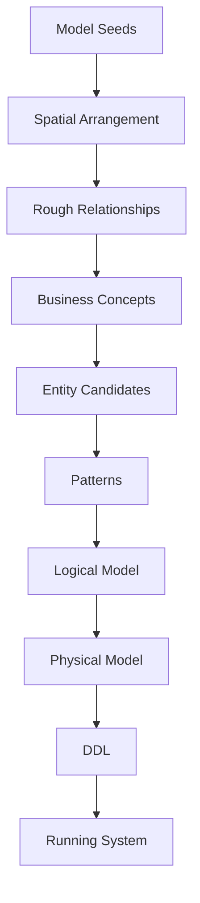
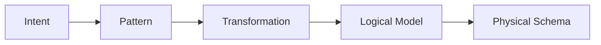
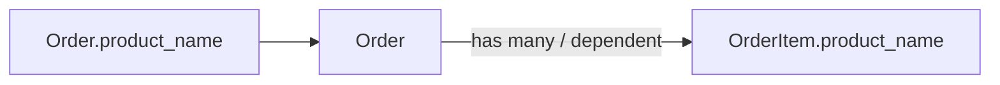
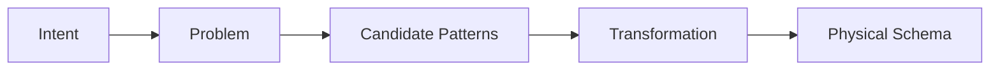
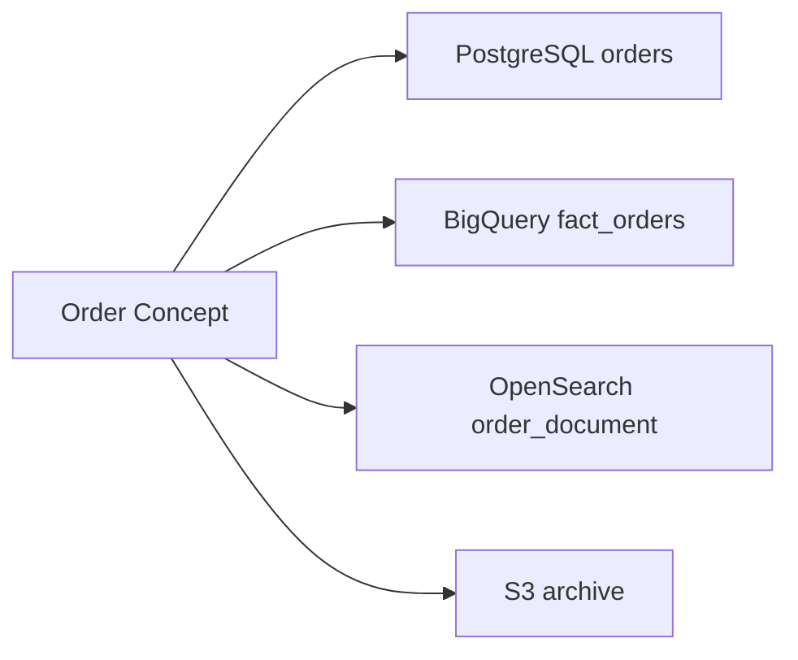

# データモデル設計支援ツール 仕様まとめ

Generated from `.knowledge` concepts.

## 目的

本ツールは単なる ER 図エディタではなく、Model Seed を自由に置いて育てる ERD Sketch Canvas / Design IDE である。

成果物としての図よりも、キャンバス上での発想、空間配置、設計プロセス、設計判断、再利用可能な設計知識の蓄積を重視する。最終的には、設計知識そのものを検索可能、進化可能、AI 支援可能にする Design Knowledge System を目指す。

## 基本モデル

モデルは以下の段階で育つ。

保持するモデルレイヤは以下。

- Business Concept: 業務意味、用語、ドメイン知識。
- Logical Concept: 実装非依存の設計概念。
- Logical Entity: 正規化された論理データ設計。
- Physical Schema: DB 固有の物理スキーマ設計。
- Storage: 保存先、派生データ、同期、鮮度、アーカイブ。

ERD Sketch Canvas は主画面であり、ER 図、DFD、論理モデルはそこから育つ表現である。

既存 UI、既存 API、SQL、既存スキーマは入力として扱うが、設計の出発点にはしない。現在の構造を移植するのではなく、業務プロセスとデータフローから再設計できる流れを優先する。

## 中核要件

- エンティティ候補を `Candidate`、`Reviewed`、`Approved`、`Deprecated` の状態で管理する。
- 最初に置く素材は Model Seed に集中する。Process Seed、External Seed、Note Seed は初期カテゴリとして前面に出さない。
- Model Seed は Miro のような自由配置キャンバス上に置き、ドラッグ&ドロップで移動できる。
- `Unsorted`、`Growing`、`Promoted` のような固定 lane は置かず、ユーザー自身の空間配置を設計情報として扱う。
- maturity は角丸の変化ではなく、Rough.js の `roughness` パラメータで表現する。seed 作成直後は最大値の `6.0` とし、`0.5` から `6.0` の範囲をスライダーで調整できる。UI 上は `0.5`、`1.25`、`3.5`、`6.0` のプリセットを持つ。
- 属性は名前、型、必須、一意、説明を持ち、追加、削除、編集、別エンティティへの移動ができる。
- 正規化は属性移動、フィールドの 1:N 化、従属エンティティ抽出、エンティティ分割、マスタ抽出、明細導入などの操作として扱う。
- フィールドを 1:N にする操作では、例として `Order.product_name` を `Order has many OrderItem` に変換し、`OrderItem` が `Order` に従属する意味を保持する。
- Relationship は単なる線ではなく、`has-a`、`is-a`、`Composition`、`Aggregation`、`dependent` の意味を持つ。
- Relationship には Cardinality、Lifecycle、Ownership、Cascade、継承方式、従属関係、削除挙動、ID スコープなどを保持する。
- 業務用語、システム用語、DB 名、API 名、別名を Vocabulary として管理する。
- Relationship にも「顧客が注文を発注する」のような業務上の述語名を持たせる。
- すべてのモデル変更は、変更前後、理由、対象、作者、時刻を含む設計判断として保存する。
- Address、Money、Period、PersonName、PhoneNumber のような Value Object を扱い、後で物理カラムへ展開できる。
- EmailAddress、PostalCode、Currency、EmployeeNumber のような Data Domain を扱い、プリミティブ型だけでは失われる意味を保持する。

## モデル変換と意味の保持

本ツールの操作は、単にテーブルやカラムを編集するのではなく、意図を持った Model Transformation として扱う。

例: 「ひとつの注文に複数商品が入る」という意図がある場合、単にテーブルを分割するのではなく、フィールドを 1:N の従属エンティティへ変換する。

このとき SQL や通常の ERD では失われやすい以下の情報を保持する。

- `OrderItem` は `Order` の外では意味を持たない従属エンティティである。
- 親子の Ownership と Lifecycle Dependency。
- 親削除時の Delete Behavior。
- 子の順序や ID スコープ。
- どの設計意図とパターンから変換されたか。
- 変換前後と理由を含む設計判断。

## 設計パターンカタログ

重要なのは変換操作そのものよりも、変換を導く設計パターンである。

各パターンは名前、意図、問題、解決策、利点、欠点、使うべき時、使うべきでない時、代替案、関連パターン、例を持つ。

パターン分類は以下を扱う。

- Entity Modeling: Entity Extraction、Entity Merge、Entity Split、Inheritance、Role Pattern、Value Object Extraction。
- Relationship Modeling: Child Entity、Dependent Entity、1:N、N:M、Associative Entity、Composition、Aggregation、Recursive Relationship。
- Attribute Modeling: Composite Attribute、Multi-value Attribute、Enum、Lookup Table、Calculated Attribute。
- Identity Strategy: Natural Key、Surrogate Key、UUID v7、ULID、Snowflake、Composite Key、Business Key、External ID。
- Normalization: 1NF、2NF、3NF、BCNF、Denormalization、Summary Table、Materialized View。
- Lifecycle: History Table、Snapshot、Business Snapshot、Transaction Snapshot、Archive、Retention、Purge、Work Table。
- Performance: Index、Composite Index、Covering Index、Partition、Cache、CQRS、Read Replica。
- Storage: OLTP、OLAP、Data Lake、Search、Cache、Object Storage、Vector Database。
- System Boundary: Single Schema、Schema per Subsystem、Database per System、Shared Database、Service-owned Database。
- Reference: Foreign Key Reference、Reference API、Local Replica、Event-synchronized Copy、CDC Replica、Transaction Snapshot、Periodic Snapshot、Manual Import、Denormalized Copy。
- Correction: In-place Correction、Red-Black Correction、Reversal、Adjustment Entry、Versioned Correction、Status-based Correction。
- Reconciliation: One-to-One、One-to-Many、Many-to-One、Many-to-Many、Partial Matching、Tolerance Matching、Suspense。
- Governance / Security / Integration: Owner、Steward、Data Quality、Data Contract、Lineage、PII、Encryption、Masking、CDC、ETL、ELT、Event Sourcing、Outbox Pattern。

パターンは実装種別だけでなく、設計意図から探索できる必要がある。

例:

- 重複データを減らしたい: Entity Extraction、Lookup Table、Value Object。
- 複数値を持ちたい: Child Entity、Dependent Entity、Associative Entity。
- 更新性能を改善したい: Entity Split、CQRS、Cache。
- 履歴を残したい: History Table、Snapshot、Bi-temporal。
- 取引時点の前提を残したい: Transaction Snapshot、Reference Value vs Actual Value、Audit Trail。
- 外部データを参照したい: Foreign Key Reference、Reference API、Local Replica、Event-synchronized Copy、Transaction Snapshot。
- 業務データを訂正したい: In-place Correction、Red-Black Correction、Adjustment Entry、Versioned Correction。
- 役割の違いを表現したい: Role Pattern、Inheritance、Separate Entities。

Pattern と Heuristic は分ける。Pattern は意図的な設計判断であり、Heuristic は状況から Pattern を示唆する診断信号である。例えば `status` カラムは State Pattern を、Append-only data は History Table を、月間数百万行は Partitioning を示唆する。

## ライフサイクルと運用設計

エンティティには作成契機、更新可能期間、削除ルール、保持期間、アーカイブ、完全削除を定義する。

削除ポリシーは以下を扱う。

- 削除禁止
- 論理削除
- 物理削除
- アーカイブ後物理削除
- 匿名化
- 無効化

状態遷移は `Draft`、`Accepted`、`Shipped`、`Completed` のような状態と、状態ごとの更新可否、遷移可否を持つ。

時間特性として `Current`、`History`、`Valid Time`、`System Time` を扱う。

## データ量と性能設計

各エンティティは日次追加件数、日次更新件数、日次削除件数、平均行サイズ、最大件数、保持期間を保持する。

そこから総件数、DB 容量、年間増加量を推計する。Relationship の平均子件数、最大子件数を使って、関連エンティティへデータ量を伝播できる。

主要クエリは名前、頻度、SLA、Join、Filter、Sort、集計を記録する。

AI レビュー対象は以下。

- Index 候補
- Partition 候補
- Summary 候補
- Cache 候補

## Storage とデータアーキテクチャ

保存先は `OLTP`、`OLAP`、`Data Lake`、`Search Index`、`Cache`、`Archive`、`Queue`、`Stream` を扱う。

ひとつの概念から複数保存先へ Projection できる。

保存先ごとに System of Record か派生データかを区別し、同期方式と Freshness を保持する。

同期方式は `CDC`、`ETL`、`Streaming`、`Manual` を扱う。Freshness は `Real Time`、`1 min`、`15 min`、`Daily` などを扱う。

大きな視点として、データがどこで生成され、どこへ流れ、どこで利用されるかを Data Flow として保持する。イベントはデータ作成、更新、削除、同期、投影の契機として扱う。これにより ERD、DWH 設計、イベント駆動アーキテクチャを一貫したメタモデルで表現できる。

DFD は独立した初期入力画面ではなく、Model Seed から発展する表現の一つとして扱う。必要になった時点で、業務プロセス、取引境界、業務責任、システム境界、データ所有、データ移動を表現する。

システム境界は Single Schema、Schema per Subsystem、Database per System、Shared Database、Service-owned Database などのパターンから選ぶ。

Master Data は必ず FK 共有するのではなく、Shared Master、Replicated Master、Reference API、Context-local Master などの配布パターンを明示する。外部データ参照も Foreign Key Reference、Reference API、Local Replica、Event-synchronized Copy、CDC Replica、Transaction Snapshot などから選べる。

Snapshot は単なる重複ではない。Historical Snapshot、Business Snapshot、Transaction Snapshot、Performance Copy、Read Model、Search Projection、Local Replica は実装が似ていても意図が異なるため、その意図を保持する。

Reference Value と Actual Value も区別する。例として、List Price と Actual Selling Price、Planned Delivery と Actual Delivery、Standard Tax Rate と Applied Tax Rate を分けることで、前提、差分、監査可能性を残せる。

Correction Pattern と Reconciliation Pattern も設計知識として扱う。訂正は In-place、Red-Black、Reversal、Adjustment Entry、Versioned、Status-based などを選べる。照合は Invoice と Payment のような独立した取引ストリームを One-to-One、One-to-Many、Many-to-Many、Partial Matching、Tolerance Matching、Suspense などで扱う。

## UI

- ERD Sketch Canvas: Model Seed を自由配置する主画面。ダブルクリックで追加、ドラッグ&ドロップで移動、クリック編集、複数選択、パン、ズーム、接続、Entity / Value Object / Data Domain への成長を扱う。
- Model Seed: 初期配置される唯一の seed 種別。名前、テキスト、位置、Rough.js roughness、role、dependency、privacy、リンク済みモデル要素を持つ。role は `transaction` をデフォルトとする。
- Model Seed Card: 外形と接続線は Rough.js で描画する。タイトルと説明はクリックで編集できる。`Rough sketch`、`Clarified` のような roughness ラベルや `Linked` という文字ラベルは表示しない。
- Roughness Control: `0.5`、`1.25`、`3.5`、`6.0` の 4 段階プリセットを持ちつつ、スライダーで `0.5-6.0` の範囲を調整できる。
- Model Seed Hints: `master/transaction/summary/history/work` は単一選択で、選択した role に応じてカード色を変える。`independent/dependent` も単一選択とする。privacy は個人情報有無の boolean toggle のみとする。relationship はモデル間の線で表現し、カードタグとしては持たない。
- Entity Candidate View: ERD Sketch Canvas 上で Model Seed が育った状態として扱う。
- Normalization View: 属性ドラッグや分割操作で正規化する。
- Transformation View: フィールドの 1:N 化など、意図と意味を保持する変換をプレビューして適用する。
- Relationship View: `has-a`、`is-a`、`Composition`、`Aggregation` とメタデータを編集する。
- Lifecycle View: 保持期間、状態遷移、削除ルールを編集する。
- Volume View: 日次件数、容量、推計結果を表示する。
- Vocabulary View: 業務用語、システム用語、DB 名、API 名、別名を管理する。
- Storage View: OLTP、OLAP、Search、Archive などへの投影を管理する。
- Pattern Library View: 設計意図でパターンを探し、比較し、適用できる。

ERD Sketch Canvas では、固定グリッドや status lane を避ける。ユーザーが近いものを近くに置く、離して置く、固まりを作る、といった空間的な操作そのものをモデリングの一部として保存する。

リンク済みかどうかは、線や昇格済みモデル要素との接続で見ればわかるようにする。カード内に `Linked` と表示して状態を説明しない。

## AI 体験とレビュー

AI はユーザーの思考を代替しない。質問攻めや必須項目チェックリストで「試験を受けている」ように感じさせず、改善パターンの手札を見せて発想を提供する。

避ける体験:

- Retention、PII、Volume、Owner などを空欄チェックリストとして一方的に埋めさせる。
- 連続質問でユーザーに不足を責められている印象を与える。
- AI が正解を押し付ける。

望ましい体験:

- History、Lifecycle、Value Object、Volume、OLAP、PII などの Design Ideas をカードとして提示する。
- 文脈から関連パターンを提案し、選択肢とトレードオフを見せる。
- ユーザーが自分で発見したように感じられる支援にする。
- AI なしでも Browse、Search、Apply できる同じ Pattern Library を使う。

例: ユーザーが `shipping` を導入したら、Address、Shipping Address、Sender Address などの関連概念を提示する。

AI は以下の観点で設計レビューも支援する。

- 正規化: 多値属性、重複属性、マスタ抽出漏れを検出する。
- ライフサイクル: 保持期間、削除ポリシー、FK、Cascade の矛盾を検出する。
- 性能: データ量とクエリから Partition、Index、Summary、Cache を提案する。
- Storage: OLAP 投影、Search 投影、Archive、Summary の必要性を提案する。
- Pattern Discovery: `status` から Enum、State Machine、History を、`type` から Enum、Role Pattern、Inheritance、Table Split を、`Address` から Value Object、Address Reuse を提案する。
- Transformation: 繰り返しフィールドから Child Entity / Dependent Entity を提案し、SQL で消える従属関係や設計意図を保持するよう促す。
- Data Flow: システム境界、Master Data Distribution、Reference Implementation、Snapshot の選択肢を提示する。
- Correction / Reconciliation: 業務訂正や取引照合が必要な場面で、適切なパターン候補を提示する。

## 将来拡張

- DDL 生成
- ER 図生成
- API 定義生成
- OpenAPI 生成
- GraphQL 生成
- イベント定義生成
- Data Catalog 生成
- データガバナンス連携
- PII 分類
- GDPR 対応
- 権限制御
- データ品質管理
- リネージ管理
- Data Contract
- System Boundary Modeling
- Data Ownership Modeling
- AI による設計レビュー、性能予測、正規化提案、インデックス提案、ストレージ配置提案、パターン推薦、変換提案、参照パターン提案、訂正パターン提案

## `.knowledge` 構成

主要 concept は以下。

- `vision:modeling-workbench`
- `concept:model-growth`
- `concept:model-layer`
- `concept:design-ide`
- `concept:design-pattern-catalog`
- `concept:intent-based-navigation`
- `concept:pattern-discovery`
- `concept:pattern-heuristic`
- `concept:assistive-ai-experience`
- `requirement:entity-management`
- `requirement:normalization-support`
- `requirement:design-decision-history`
- `requirement:performance-design`
- `requirement:ai-review`
- `requirement:pattern-library-experience`
- `data:entity`
- `data:attribute`
- `data:value-object`
- `data:data-domain`
- `data:design-pattern`
- `data:model-seed`
- `data:model-transformation`
- `data:dependent-entity`
- `data:relationship`
- `data:data-lifecycle`
- `data:volume-estimate`
- `data:query-profile`
- `data:concept-projection`
- `data:data-flow`
- `data:governance-metadata`
- `data:system-boundary-pattern`
- `data:data-ownership`
- `data:master-data-distribution`
- `data:reference-implementation`
- `data:snapshot-reference`
- `data:reference-actual-value`
- `data:correction-pattern`
- `data:reconciliation-pattern`
- `event:data-change-event`
- `term:vocabulary`
- `term:relationship-vocabulary`
- `rule:model-seed-labels`
- `ui:erd-sketch-canvas`
- `ui:pattern-library-view`
- `ui:transformation-view`
- `flow:dfd-first-modeling`
- `flow:modeling-lifecycle`
